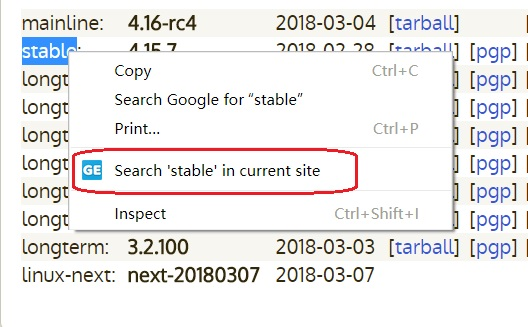
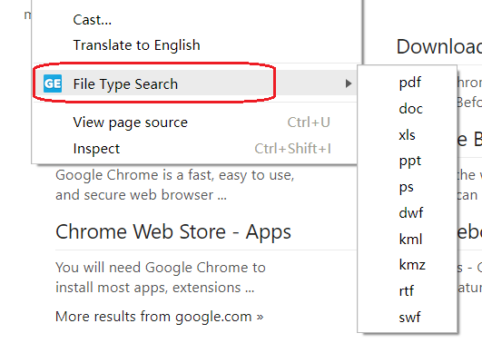
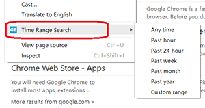
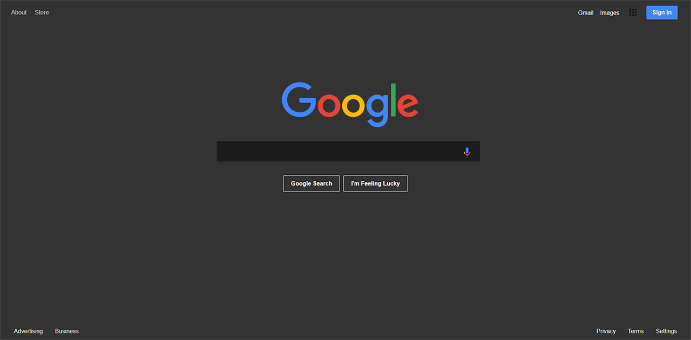
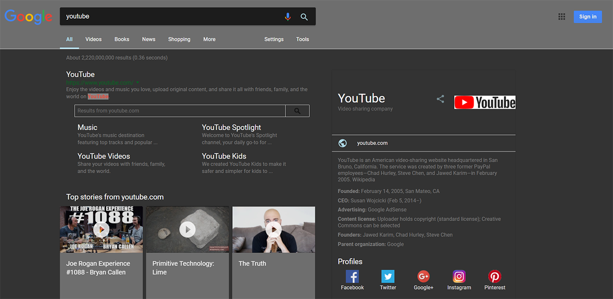
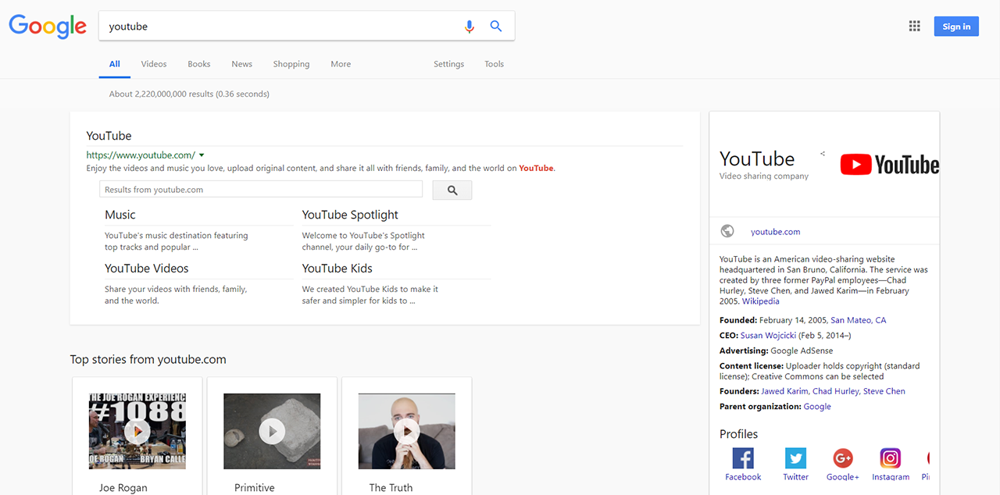
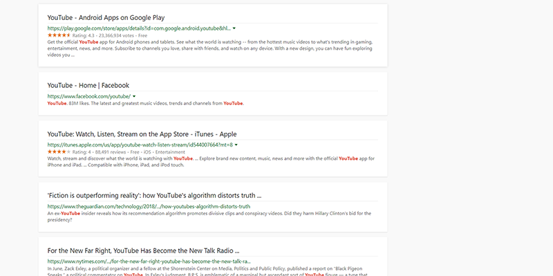
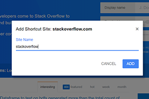
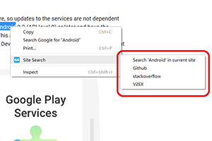
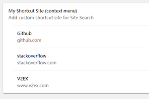

<h1 align="center"> Google Enhancer</h1>

  <strong>Make Google Search more beautiful and convenient</strong>

  <a href="#features">Features</a> •
  <a href="#update">Update</a> •
  <a href="#instruction">Instruction</a> •
  <a href="#download">Download</a> •
  <a href="#faq">FAQ</a> •
  <a href="#credits">Credits</a> •
<a href="#feedback">Feedback</a> •
  <a href="#donate">Donate</a> •
  <a href="#license">License</a>

## Features

* **Shortcut operation**
* **Easy access for site/filetype/time search**
* **Custom shortcut site**
* **Keywords highlight**
* **Load results endlessly**
* **Night mode**
* **Card-style UI**
* **Sync settings via Chrome**

## Update
> ### v1.1.1 (2019/02/17)
>
> #### Remove:
>
> - remove search form pinned on top function
> ### v1.1.0 (2018/03/22)
>
> #### New:
>
> - [My Shortcut Site](#my-shortcut-site)
>
> #### Improve:
>
> - improve Night mode

## Instruction
_Notice: changes will not take effect until you refresh page.(Press F5)_
1. **Use arrow keys to flip pages**  
Use arrow keys to previous/next page, make your browsing experience faster and smoother.

2. **Double click back to top**  
When browsing to the page end, you can quickly go back to top via double click at any blank area.

3. **Open link in new tab**  
If this enabled, search result links will always be opened in a new tab.

4. ~~**Search form pinned on top**~~  
~~If this enabled, search form will always show on top when scrolling page, so you can easily start a new search.(temporarily unavailable for image search)~~

5. **Endless google**  
A function transplanted from [Endless Google][Endless Google] which will load more results automatically when you scroll to the end of a page.

6. **Keywords color**  
Highlight keywords in text area of result, so that you can easily figure them out.

7. **Keywords background color**  
Customize keywords background color.

8. **Keywords background color opacity**  
Customize keywords background color opacity.

9. **Site search (context menu)**  
Use google to search selected words in current site quickly.(see image below)

10. **Filetype search (context menu)**  
Find pages in the format you prefer.(see image below)

11. **Time Range search (context menu)**  
Find pages updated within the time you specify.(see image below)

12. **Night mode**  
A function transplanted from [Google Night Mode][Google Night Mode] which turn the page to dark.(see image below)

13. **Card style UI**  
A function transplanted from [Google Card-Style UI][Google Card-Style UI] which greatly beautify google UI.(see image below)

14. ##### My Shortcut Site
 This function will allow you to add custom site in Site Search.  
After enabled, you can add any site into Site Search menu.(see image below)

 Then you can search seleted text not only in current site, but also the custom shortcut site which you just added.(if not see, refresh current page)

You can also delete some shortcut site in option page(if not see, refresh option page)

## Download

You can download and install from [Chrome Webstore](https://chrome.google.com/webstore/detail/google-enhancer/ikbcccnfbfobgioefgaodgmnnnbjbbfn).

## FAQ
* **Q: Does google-enhancer have i18n support ?**
* A: Yes, it currently support English and Simplified Chinese, and will add other languages if I learn more in future:blush:.

* **Q: Can I enable night mode and card-style ui together ?**
* A: Yes, although I don't recommend to do so. Considering some user may want to enable them at same time,I made some changes to let them work together.

* **Q: Why site search / my shortcut site function not work ?**
* A: First, you need enable site search / my shortcut site function, then select the text you want to search, then right click and site search item will show.

* **Q: Can I sync settings between different computers ?**
* A: Yes. You just need to login your Chrome, and extension will sync settings automatically via your google account.

* **Q: After read all above, why I still can't understand how to use ?**
* A: Sorry for my poor english, I swear will improve it in the rest of my life, but actually you can try it yourself, `Genuine knowledge comes from practice`:blush:.

## Credits

This extension uses code from several open source projects.  
As one of the contributors for [v2ex-plus], I really learnt a lot from seniors, thank them and all these project below.

- [v2ex-plus]
- [Endless Google]
- [Google Card-Style UI]
- [Google Night Mode]

## Feedback

Find a bug or have a feature request? Please file an <a href="https://github.com/satorioh/google-enhancer/issues" targe="_blank">issue</a>, or send mail to wangbinxp@gmail.com

It would be great if you could read our [FAQ](#faq) first or search in the issues before you post, to avoid duplicates.

All requested features have been summarized [here](https://github.com/satorioh/google-enhancer/issues/1). Welcome to vote for/against them.

## Donate

Currently I'm looking for a front-end job, if you're interested in me, please send mail to wangbinxp@gmail.com.

If you enjoy my works, please consider making a donation, thank you!

## LICENSE
[MIT](LICENSE)

[Endless Google]: https://openuserjs.org/scripts/tumpio/Endless_Google
[Google Card-Style UI]: https://openuserjs.org/scripts/Thesunfei/Google_Card-Style_UI
[Google Night Mode]: https://greasyfork.org/zh-CN/scripts/35252-google-night-mode
[v2ex-plus]: https://github.com/sciooga/v2ex-plus
